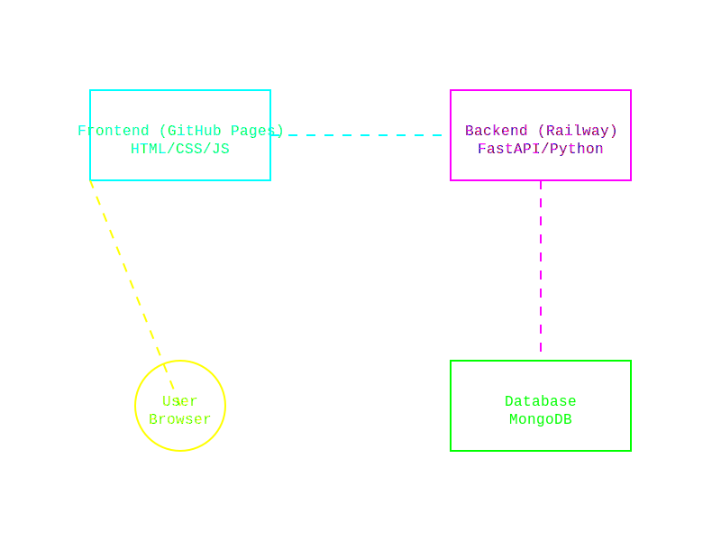
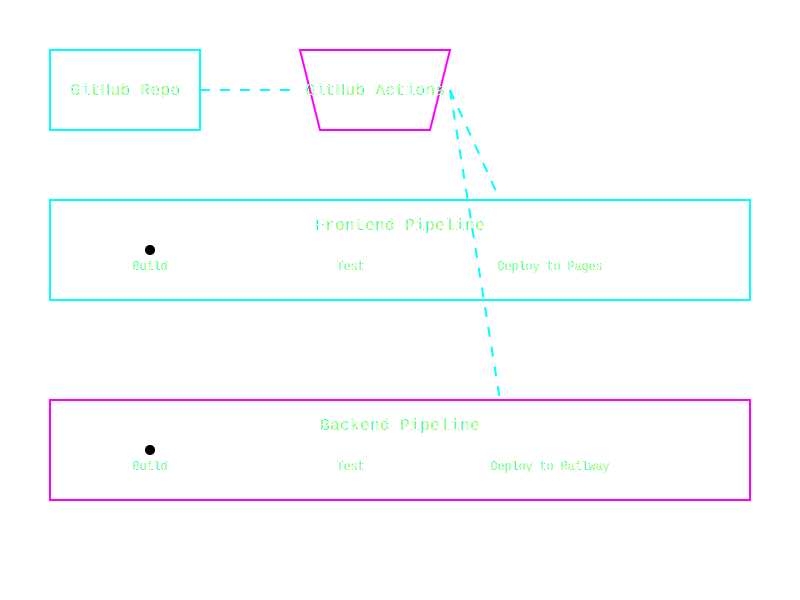

# Building and Deploying a Full-Stack App with AI in Under 2 Hours: A Journey with Windsurf

Hey there, tech enthusiasts! 👋 Today, I'm going to share an incredible journey of building and deploying a full-stack financial dashboard application using AI assistance. The twist? We did it all in under 2 hours! Let's dive into how we leveraged Windsurf AI to create a modern web app with a FastAPI backend and a sleek vanilla JavaScript frontend.

<div align="center">
  
  <p><em>The Cyberpunk Dance: AI and Human Collaboration in Modern Development</em></p>
</div>

## TL;DR Takeaways 🚀

- AI is best used as a pair programmer that understands system design
- Focus on explaining components and wireframes clearly to AI
- Quality assurance is still your responsibility
- Modern deployment tools make CI/CD a breeze
- The future of development is human-AI collaboration

## The Stack 🛠️

<div align="center">
  
  <p><em>Neon-lit Architecture: Our Full-Stack System Design</em></p>
</div>

- **Frontend**: Vanilla JavaScript, HTML5, CSS3
- **Backend**: FastAPI (Python 3.12)
- **Database**: MongoDB
- **Deployment**: GitHub Pages (Frontend) + Railway.app (Backend)
- **CI/CD**: GitHub Actions
- **AI Assistant**: Windsurf IDE with Cascade

## The Development Workflow 🔄

<div align="center">
  
  <p><em>The Digital Pipeline: Automated Deployment Flow</em></p>
</div>

### 1. Setting Up the Project Structure (10 minutes)

Instead of spending hours setting up boilerplate, I described the project structure to Windsurf:

```
/app
  /DataAccessLayer
  /models
/js
/css
/data
server.py
index.html
```

Windsurf generated the initial files and even added proper `.gitignore` and dependency management files. Talk about a time-saver!

### 2. Frontend Development (30 minutes)

The frontend development was fascinating. Instead of writing CSS from scratch, I simply told Windsurf:

> "Create a modern dashboard with a sidebar navigation, dark mode support, and a main content area showing financial metrics."

Windsurf generated:
- Responsive CSS Grid layout
- Dark/Light theme toggle
- Interactive components
- Local storage for user preferences

Pro tip: Be specific about UI/UX requirements. The more detailed your description, the better the AI understands your vision.

### 3. Backend API Development (40 minutes)

The backend was where Windsurf really shined. We needed:
- FastAPI server with CORS support
- MongoDB integration
- Financial data models
- CRUD operations

Instead of writing boilerplate code, I guided Windsurf through the architecture:

```python
# Windsurf generated this clean MongoDB DAO pattern
class FinanceDAO:
    def __init__(self, client):
        self.db = client.finances
        self.income_collection = self.db.income
        self.bills_collection = self.db.bills
```

### 4. Deployment Configuration (30 minutes)

Here's where it gets interesting! We needed to deploy to two different platforms:

1. **Frontend to GitHub Pages**:
```yaml
name: Deploy Frontend
on:
  push:
    branches: [ main ]
    paths:
      - 'index.html'
      - 'css/**'
      - 'js/**'
```

2. **Backend to Railway.app**:
```yaml
name: Deploy Backend
on:
  push:
    branches: [ main ]
    paths:
      - 'server.py'
      - 'app/**'
```

Windsurf handled all the YAML configuration, while I managed the service connections through browser interfaces.

## The AI Advantage 🤖

Working with AI isn't about replacing developers - it's about supercharging productivity. Here's what made it work:

1. **Clear Communication**: I provided clear, component-by-component descriptions
2. **Quality Checks**: While AI wrote the code, I reviewed and tested each feature
3. **Service Integration**: I handled service authentications while AI handled code
4. **Iterative Development**: Quick feedback loops between human and AI

## Challenges and Solutions 🎯

1. **MongoDB String vs Number Types**: When we migrated from JSON to MongoDB, numbers were returned as strings. Windsurf quickly identified and fixed the type conversions.

2. **Railway Service Names**: Initial deployment failed due to incorrect service names. We fixed it by using Railway CLI to get the correct name.

3. **Environment Variables**: Secured MongoDB credentials using GitHub Secrets and Railway's environment variables.

## Conclusion 🎉

Building a full-stack app in under 2 hours might sound impossible, but with AI assistance, it's not just possible - it's efficient! The key is understanding that AI is a collaborator, not a replacement. You still need to:

- Understand system architecture
- Make critical decisions
- Review and test code
- Handle service integrations

The future of development isn't about AI taking over; it's about developers becoming conductors, orchestrating AI tools to build better software faster.

Remember: The best code is not just about what you write - it's about how effectively you can communicate your vision to your tools, whether they're human or AI.

Happy coding! 🚀

---
*Written on March 15, 2025*
